# FusionPBX Visual Dialplans

## Overview
The Visual Dialplans app is a part my extensions library for FusionPBX, designed to manage and visualize dialplan configurations. This app allows users to view, edit, and manage dialplan settings, making it easier to configure call routing and other telephony features.

## Features
- **Automatic synchronization**: Automatically synchronized XML file as you update the drag-and-drop elements of the dialplan.
- **Simple rule checking**: Checks for simple mistakes and gives error notifications.
- **Dialplan Management**: Users can add, edit, and delete dialplans.
- **Context Filtering**: Users can filter dialplans by context to manage specific sets of rules.
- **Search Functionality**: Users can search for dialplans by name, number, or description.
- **Toggle Enabled/Disabled**: Users can enable or disable dialplans as needed.

## Usage
1. **Access the App**: Navigate to the Visual Dialplans section in the FusionPBX dashboard.
2. **View Dialplans**: The app displays a list of all dialplans, with options to filter and search.
3. **Edit Dialplans**: Click on a dialplan to edit its settings.
4. **Add New Dialplans**: Use the "Add" button to create new dialplan configurations.
5. **Toggle Status**: Use the toggle button to enable or disable dialplans.
6. **Export XML**: Use the "XML" button to export the current dialplan configuration in XML format.

## Permissions
- **dialplan_view**: View dialplans.
- **dialplan_add**: Add new dialplans.
- **dialplan_edit**: Edit existing dialplans.
- **dialplan_delete**: Delete dialplans.
- **dialplan_xml**: Export dialplans in XML format.

## Images and Snapshots
- **Visual Dialplan Editor**: 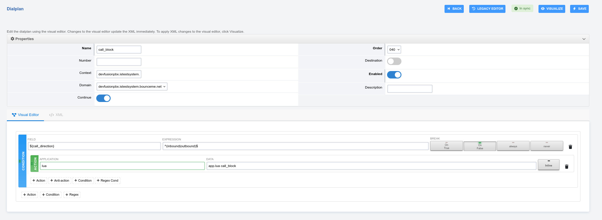
- **Syncronized XML View**:
  - 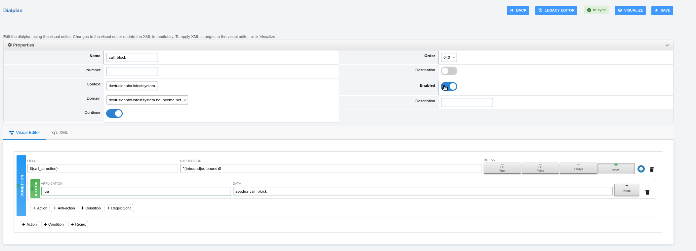
  - 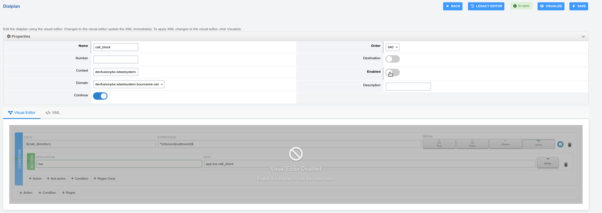
- **Pop-out XML View**: 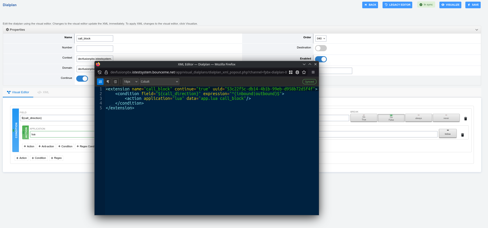
- **Three-way buttons**:
  - 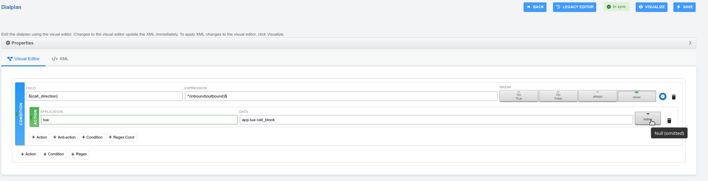
  - 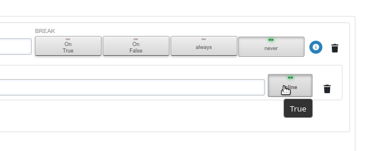
  - 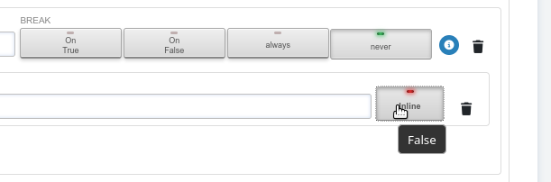
- **Drag-and-drop**: 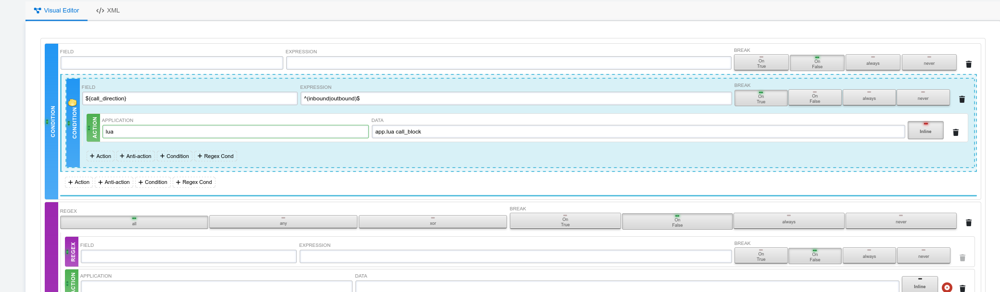
- **Nesting**:
  - 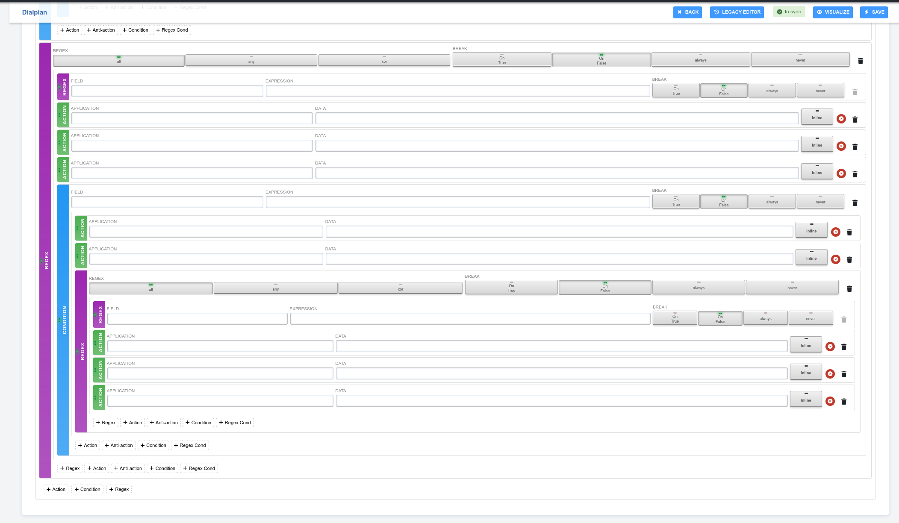
- **Autocomplete as you type**:
  - 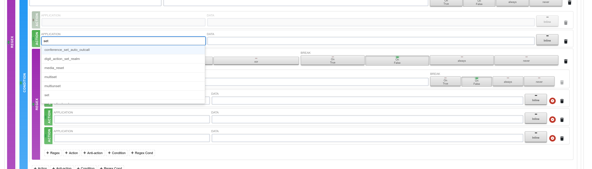
- **Rules based error checking**:
  - 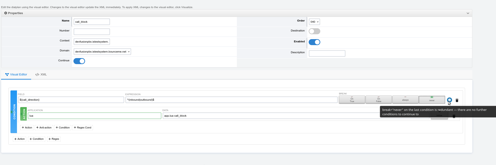
  - 

## Migrate
The current dialplan editor uses a hybrid approach where the xml file OR the dialplan details can determine the final xml values used depending on which one was last saved. This version uses a single authority of the XML file as the ultimate authority.

The included tool: `php app/visual_dialplans/resources/migrate_to_unified.php` will ensure all dialplans can use the new visual tool.

Once the XML file is saved, this editor will be needed to edit the entry. It is assumed that you will not use the old one once this one is installed.
